## **Project Overview**

**TuitionPedia4You.com** is an educational web platform designed to help students easily find tutors and access academic support at an affordable cost.

### Main Objective:
To provide **high-quality, accessible academic assistance** to students by connecting them with tutors through a user-friendly online platform.

### Technologies Used:
- **Frontend**: HTML, CSS, JavaScript – for designing the user interface and forms.
- **Backend**: PHP, MySQL – for handling data storage, user registration/login, and server-side logic.
- **Tools**: VS Code (for coding), XAMPP (for local server and database testing)

### Key Features:
- Students and guardians can **search for available tutors**.
- Tutors can **create profiles and apply for tuition opportunities**.
- User **authentication system** (login/registration).
- **Filtering options** for finding tutors and tuition posts.
- **Responsive design** that works smoothly on both desktop and mobile.

---

# Some important pages snapshot of the project:

## Homepage
**Purpose**: Main landing page for navigation and access to core features.

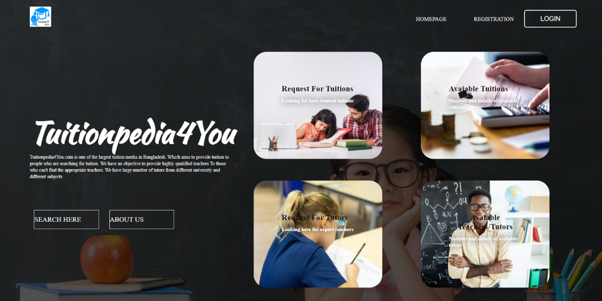

About us section: 

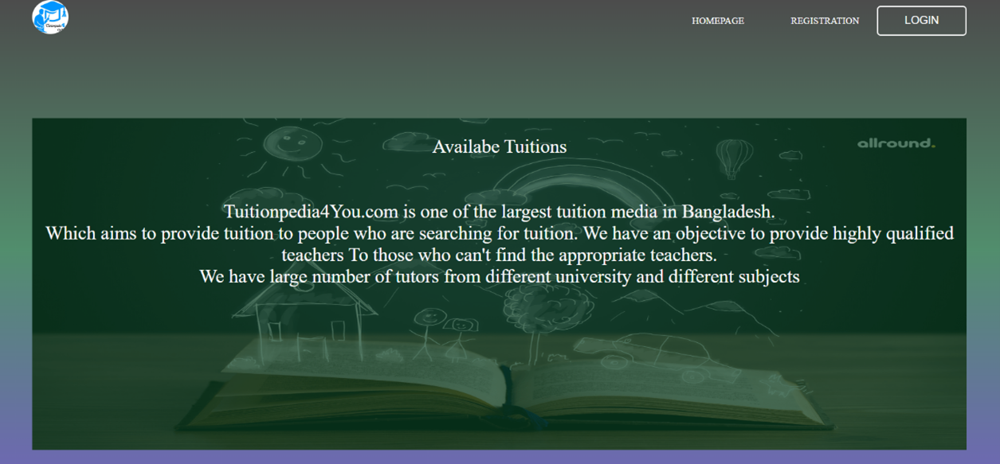

---

## Available Tuitions
**Purpose**: Displays tuition posts with apply option.

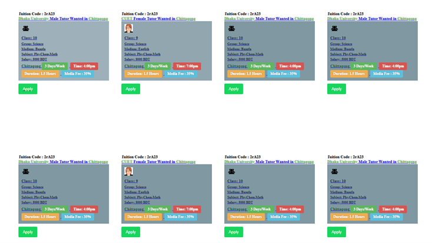  

Tuition apply form: 

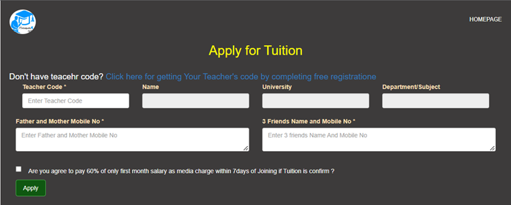

---

## View Tutor Details
**Purpose**: Shows tutor profiles and full details via view button.

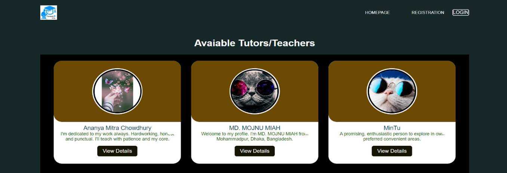  

Tutor information: 

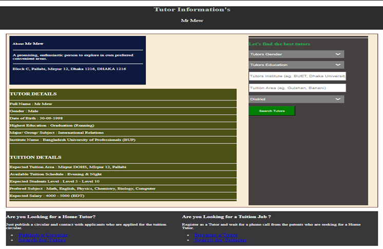

---

## Admin Portal
**Purpose**: Admin can manage tutors, tuitions, payments, and settings.

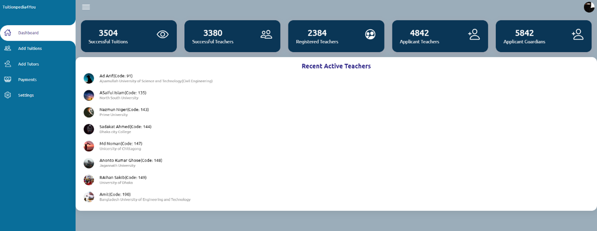  

Admin setting section: 

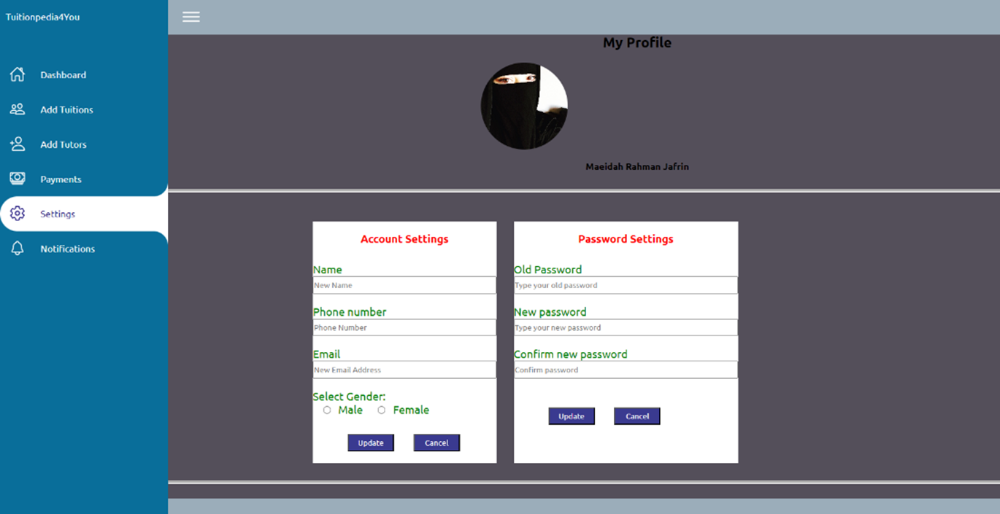  

---

## Tutor Portal
**Purpose**: Tutors can view and update their profile and preferences and change their account password securely.

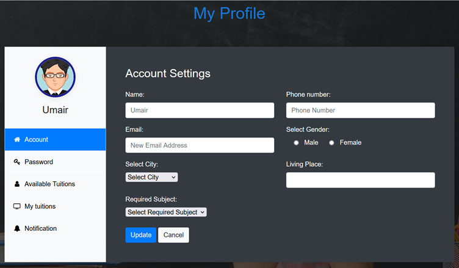

---

## Registration Page
**Purpose**: Collects user data and stores it in the database.

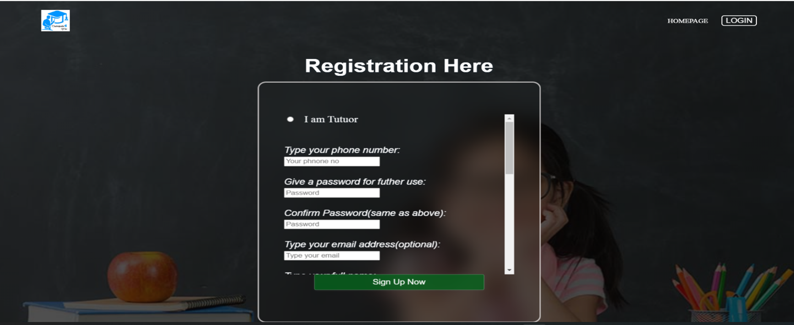

---

## Login Page
**Purpose**: Login based on user type (User/Admin).

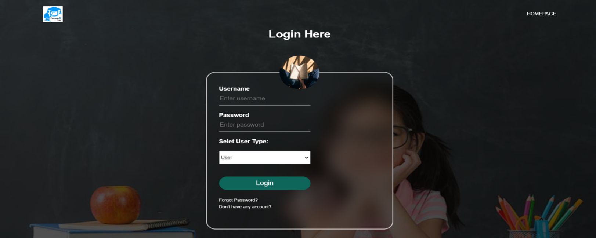

---

## Forgot Password
**Purpose**: Reset password by verifying username and user type.

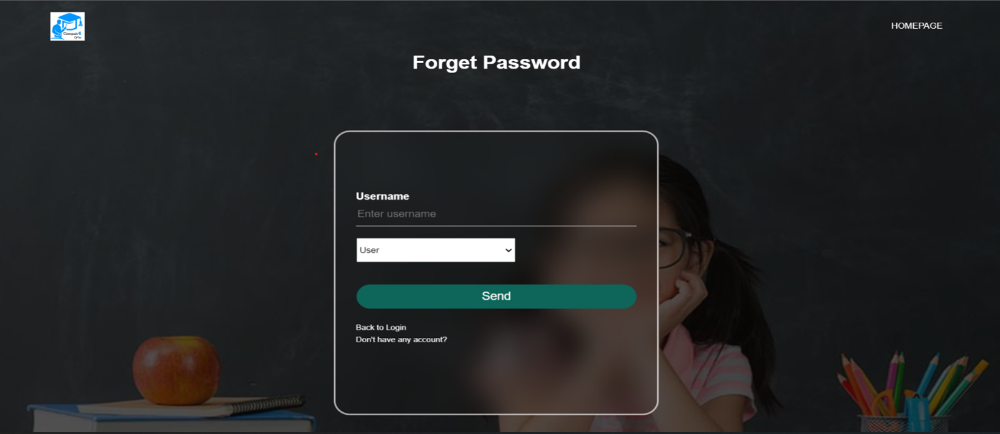

---

**Completing this project strengthens our full-stack web development skills and enables 
us to build functional, secure, and user-friendly websites. It addresses online and offline 
tuition-related issues while creating future job opportunities through hands-on experience.**

